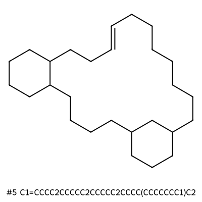
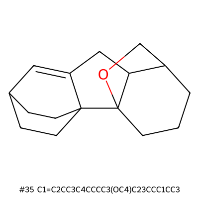

# Templates

![[SH]12[Fe]34[SH]5[Fe]16[SH]1[Fe]27[SH]3[Fe]51467](img/3a22fb084c8f325826d819698699b1da65a5dc9144269a42a6dbfd4516328526.svg)![C1=c2ccc3n2[Ni]24n5c1ccc5C=c1ccc(n12)=Cc1ccc(n14)C=3](img/e88036a52e22f548468a7a1aae2889732fbd34b7ebe5f151873c9fea62cf181d.svg)![C1=C2C=c3ccc4n3[Ni]n3c(ccc3=CC(=N2)C1)=CC1=CCC(=N1)C=4](img/b3653167dfb19780b45101d1ac34aaf5b77feeb5556ff7e87fe1fef278a04c7a.svg)![C1=c2cc3ccc(cc4nc(cc5ccc(cc(n2)C1)[nH]5)=CC4)[nH]3](img/6d595fbdc172bd047f078fbdd5eae3a727505ade727d285353cd66e075a8f1e8.svg)